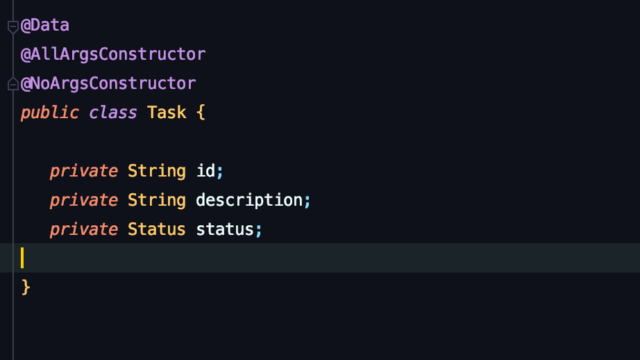
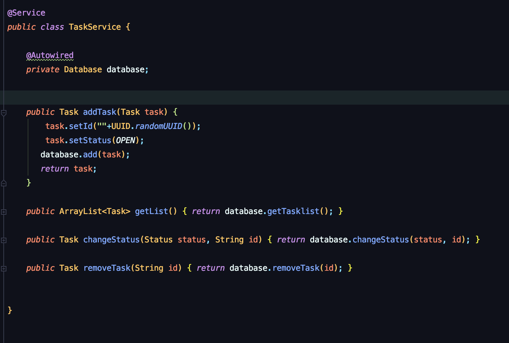
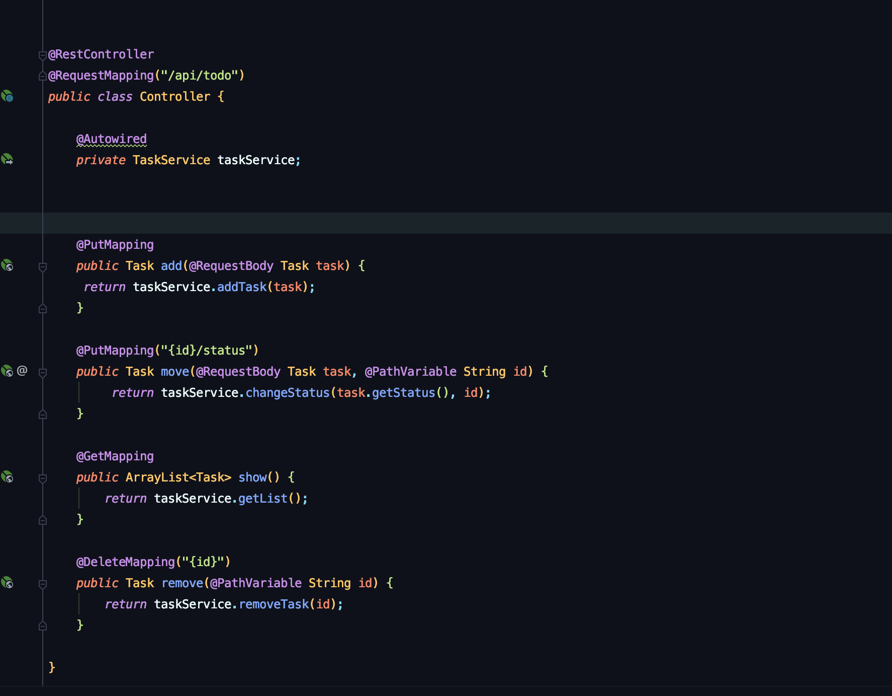

## Setup Spring Server for an ToDo App Backend! 

### Architecture of the Backend

 *exemplary classes for our backend-infrastructure*

**I. Controller (highest layer with Rest-Controller)**  
**II. Service**  
**III. Database**  
**IV. Models - several, single Items or enums**

# Step 1:
1. Set up packages and empty classes at first.

# Step 2:
### Controller - Initial 

Controller is the interface (Schnittstelle) between our back- and frontend.
1. First its necessary to initialize it.
 

# Step 3:
### Models

1. Initialize your Task class, from which you create the core instances for your later program.   
2. Dont forget to set `@Data` (for all the getters, setters & toString method) and `@AllArgsConstructor aswell as the `@NoArgsConstructor`.   
     

3. Set up and initialize your Status-Class to provide Status-"Type" for the Task Class and also for the method setStatus (necessary later) 

# Step 4:
### Database 

1. Set up your Database with an empty Arraylist of Tasks, which will store all the instances of Tasks.  
2. Dont forget to set @Data and @Repository(to provide dependency Injection for the Service class)
3. You create all the methods which logic right here aswell.     

# Step 5:
### Service

1. Set the `@Service` Annotation to provide Methods and dependency Injection for the Controller
2. Initialize the attribute(s) to get methods from the lower layers (in this case: `private Database database)
3. Autowire the attributes (`@Autowired`) to get access to lower layer methods and variables of `Database. 
4. Define methods by grabbing (database.XY(param)) them from the lower layer (Database):         
Example:    
`public Task removeTask(String id) {return database.removeTask(id); }``

# Step 6:
#### Explanation for method `add`:
 
* Task Type(Class) has three Values (ID, Description, Status). When the method is called from the Controller it will only provide the description-parameter, which we pass on to the database with `database.add(task).

* ID and Status are null when the method is called, which means they have to be defined manually.
For this purpose we call the setId and setStatus method of the Task-Class. 
* The setId method expects an String-parameter - herefore we cast a random UUID to a String. 
* The setStatus method assigns the OPEN Status to the added Task, because the method addTask is called only when a new Task is created (new Tasks are of course always "open")

# Step 7:
## Controller + FrontEnd-API

### <ins>**Important!**</ins>    
### **Dependent on the Information provided by the FrontEnd Application you have to configure the API-Endpoints in your Backend Controller.**

## Step 7.1
####  We begin with our add-Method
    
   * First check the requirements for add-Method, which is responsible for adding new Items to our ToDo-App.  
   *  In the following image you can see the informations which are shown at the browser console inside of the network-tab as soon as you press **ADD** (<ins>blue button above "In Progress"</ins>).
      1. the requested URL-path from the Frontend is the **api/todo**
      2. the requests Method is **PUT**
      3. the provided String is **blub** (User Input). This string will become our **description** parameter in our **addTask** Method.

## Step 7.1.1
#### Typical Backend Response
In the image below you can see the `response` of the backend after passing into the addTask Method, because the addTask method receives the description `blub` through the User, adds the `id`and the `status` inside the `Service`-Class, stores everything in the `Database`-Class and **after** all that steps it replys everything back to frontend(which is actually not mandatory, but nice to have, because we can observe that result now in Response-Tab of our Browser - see below).

## Step 7.2
#### We continue with our move-Method (which is changing the Status from "Open" to "in Progress" to "Done" whenever to click on the corresponding button)
   * As you can see in the image below, our FrontEnd is providing a Status String "IN_PROGRESS" (or "DONE") in the Requested Payload-tab. 
   * To grab and use this information its necessary to write an API-Endpoint in our Controller which is accepting the String, which uses our ID and status as path (`{id}/status`) and which has PUT as request Method.
    
    

## Step 7.3
#### Finally the delete-Method 
   * If you click on the delete button on a single Item our FrontEnd is providing us the ID-Path with a requested DELETE-Method.
   * Here you need to write an API-Endpoint in our controller which is just handling the ID `{Id}` and which has a `@DeleteMapping`-Annotation
    

## Step 8
### **Grande Finale**
   * After we examined and noted all the information which are delivered by the FrontEnd we are now able to finish our Controller which we already defined without methods in Step 2.
   * First we Autowire our Service-Class (@Autowired private TaskService taskService;`)
   #### 1. Then we define a PutMapping Annotation for the **add-Method**(1), because after clicking ADD in the Frontend we trigger the `/api/todo` (see step 7.1) path (thats why the path behind `@PutMapping` for the add-method is empty, because its already the default path from the `@RequestMapping` above)
   1.1 The add method includes the return Type "Task" and the @PutMapping Annotation` requires a @RequestBody Annotation in the Parameter to pass the value from the FrontEnd in the lower layers. 
      
   2.1 Inside the method statement its returning the value of the taskService method "addTask", which takes the passed value "task" from the @RequestBody.  
        
   #### 2. Next we define the API-Endpoint for our **move (change status) - Method**. It requires also a @PutMapping annotation, thats why its mandatory to set a specific path this time since each @PutMapping Annotation needs to have its own path to get called. 
   2.1 As we have seen in **Chapter 7.2** the FrontEnd requires for our status-change method a path with the the dynamic Id (thats why we use the curly brackets around Id) + /status --> `("{id}/status)`
   
   2.2 The method itself returns also the Task and requires first a `@RequestBody Task task`, which provides the information of for one Task-Item to check the actual Status - see one line below task.getStatus()) 
   
   2.3 As the second parameter it requires the @PathVariable String id` which is delivered by the dynamic path in the curly brackets from the FrontEnd `("{id}")`. This Id will also be passed to give the backend the information about which Item/Task should be grabbed and change status in the lower-layers.
   
  #### 3. The last function of our App is to remove a Task. For that purpose the FrontEnd requires a `@DeleteMapping` (see in **Chapter 7.3**), with a dynamic Id as a Parameter ("{id}")`.
   3.1 The corresponding Id will be passed from the @DeleteMapping Annotation through the @Pathvariale Annotation inside the Methods Statement taskService.removeTask(id); 
   
   3.2 Note that its really important that the Pathvariable Parameter in `remove` has the same spelling like the parameter in the @DeleteMapping. (The same goes for the @Pathvariable in the parameter of the "move"-method above.)

## Thats all - after all these steps start the server and have fun :p 

