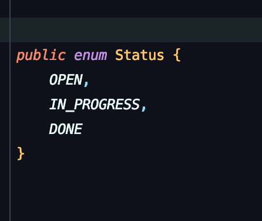
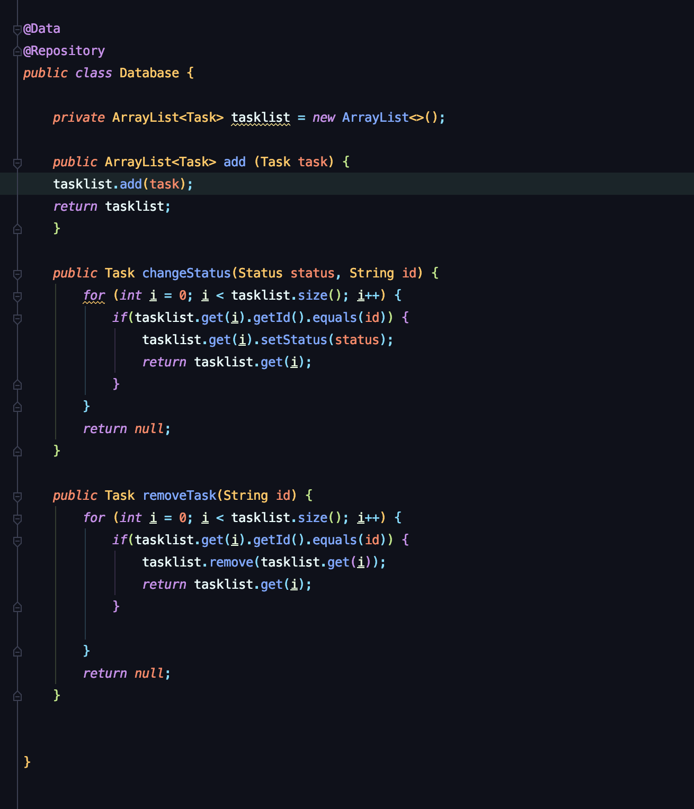

## Setup Spring Server for an ToDo App Backend! 

###Architecture of the Backend
### Set up several backend layers 
#### Create Classes for that 

I. Controller (highest layer with Rest-Controller)  
II. Service   
III. Database  
IV. Models - several, single Items or enums (ignore PassedStatus)

# Step 1:
1. Set up packages and empty classes 

# Step 2:
### Controller - Initial 

Controller is the interface (Schnittstelle) between our back- and frontend.
1. First its necessary to initialize it.
 

### Models

1. Initialize your Task class, from which you create the core instances for your later program.   
2. Dont forget to set @Data (for all the getters, setters & toString method) and @AllArgsConstructor aswell as the @NoArgsConstructor.   
3. Set up and initialize your Status-Class to provide Status-"Type" for the Task Class and also for the method setStatus (necessary later)      

### Database 

1. Set up your Database with an empty Arraylist of Tasks, which will store all the instances of Tasks.  
2. Dont forget to set @Data and @Repository(to provide dependency Injection for the Service class)
3. You create all the methods which logic right here aswell.     

### Service

1. Set @Service Annotation to provide Methods and dependency Injection for the Controller
2. Initialize the attribute(s) to get methods from the lower layers (in this case: private Database database)
3. Autowire the attributes (@Autowired above attribute), to get access to lower layer methods and variables. 
4. Define methods by grabbing (database.XY(param)) them from the lower layer (Database):         
Example: public Task removeTask(String id) {return database.removeTask(id); }

#### Explanation for method addTask:
 
Task Type(Class) has three Values (ID, Description, Status). When the method is called from the Controller it will only provide the description-parameter.
ID and Status are null when the method is called, which means they have to be defined manually.
For this purpose we call the setId and setStatus method of the Task-Class. The setId method expects an String-parameter - herefore we cast a random UUID to a String. 
The setStatus method assigns the OPEN Status to the added Task, because the method addTask is called only when a new Task is created (new Tasks are of course always "open")

### Controller - Complete

Dependent on the Information provided by the FrontEnd Application you have to configure the API-Endpoints in your Backend Controller

